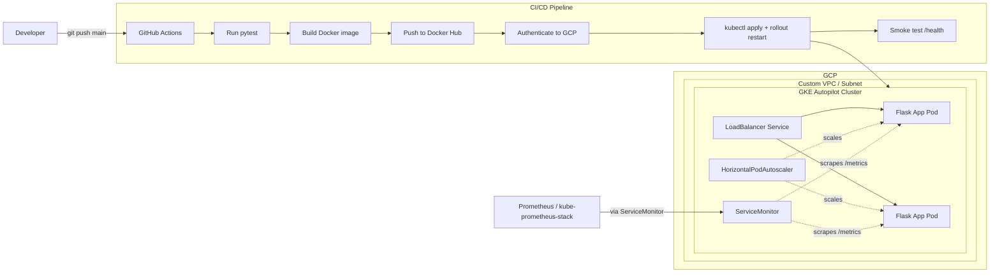

# GCP GKE Terraform CI/CD & Monitoring

A small end-to-end DevOps showcase project: a containerized Python (Flask) application, provisioned on **Google Kubernetes Engine (Autopilot)** with **Terraform**, deployed automatically through a **GitHub Actions CI/CD pipeline**, and observed with **Prometheus** metrics.

The goal of this repository is to demonstrate a realistic, minimal-but-complete DevOps workflow: Infrastructure as Code → containerization → automated build/test/deploy → runtime observability.

---

## Architecture



**Flow summary:**
1. Infrastructure (VPC, subnet, GKE Autopilot cluster) is provisioned once via Terraform.
2. Every push to `main` triggers the pipeline: run unit tests → build & push a Docker image (tagged `latest` and with the commit SHA) → authenticate to GCP → apply Kubernetes manifests → restart the deployment to pull the new image → run a smoke test against the live `/health` endpoint.
3. The app exposes Prometheus-compatible metrics, scraped through a `ServiceMonitor`.
4. An HPA scales the deployment between 2 and 5 replicas based on CPU utilization.

---

## Tech stack

| Layer            | Technology                                      |
|-------------------|--------------------------------------------------|
| Application       | Python 3.12, Flask, `prometheus-flask-exporter` |
| Testing           | pytest                                           |
| Containerization  | Docker                                           |
| Infrastructure    | Terraform, Google Cloud (VPC, GKE Autopilot)     |
| Orchestration     | Kubernetes (Deployment, Service, HPA, ConfigMap) |
| CI/CD             | GitHub Actions                                   |
| Monitoring        | Prometheus (`ServiceMonitor`, `/metrics`)        |
| Registry          | Docker Hub                                       |

---

## Repository structure

```
.
├── app/
│   ├── main.py           # Flask application (/, /health, /metrics)
│   └── test_main.py      # Unit tests for all endpoints
├── terraform/
│   ├── providers.tf      # Terraform + Google provider configuration
│   ├── variables.tf      # Input variables (project, region, names)
│   ├── main.tf           # VPC, subnet, GKE Autopilot cluster
│   ├── outputs.tf        # Cluster name/location, network outputs
│   └── terraform.tfvars.example
├── k8s/
│   ├── configmap.yaml     # App configuration (name, env, version)
│   ├── deployment.yaml    # Deployment with probes and resource limits
│   ├── service.yaml       # LoadBalancer Service
│   ├── hpa.yaml            # HorizontalPodAutoscaler (2–5 replicas, 70% CPU)
│   └── servicemonitor.yaml # Prometheus Operator ServiceMonitor
├── .github/workflows/
│   └── ci-cd.yml           # Build, test, push, deploy, smoke test
├── Dockerfile
└── requirements.txt
```

---

## Getting started

### Prerequisites
- A GCP project with billing enabled
- `terraform` >= 1.5.0
- `gcloud` CLI, authenticated (`gcloud auth login`)
- A Docker Hub account
- `kubectl`

### 1. Enable required GCP APIs
```bash
gcloud services enable compute.googleapis.com container.googleapis.com
```

### 2. Provision the infrastructure
```bash
cd terraform
cp terraform.tfvars.example terraform.tfvars   # edit with your project_id
terraform init
terraform plan
terraform apply
```
This creates a custom VPC, a subnet, and a GKE **Autopilot** cluster.

### 3. Configure GitHub Actions secrets
The pipeline expects the following repository secrets:

| Secret               | Description                                   |
|-----------------------|------------------------------------------------|
| `DOCKERHUB_USERNAME`  | Docker Hub username                            |
| `DOCKERHUB_TOKEN`     | Docker Hub access token                        |
| `GCP_SA_KEY`          | JSON key of a GCP service account with GKE deploy permissions |
| `GKE_CLUSTER_NAME`    | Name of the GKE cluster (from Terraform output)|
| `GKE_REGION`          | Cluster region, e.g. `europe-central2`         |
| `GCP_PROJECT_ID`      | GCP project ID                                 |

### 4. Deploy
Push to `main` — the pipeline in `.github/workflows/ci-cd.yml` will run tests, build and push the Docker image, connect to the GKE cluster, apply everything under `k8s/`, restart the deployment, and verify the app is healthy via `/health`.

### 5. (Optional) Monitoring
The `ServiceMonitor` in `k8s/servicemonitor.yaml` assumes a Prometheus Operator stack (e.g. `kube-prometheus-stack`) is already installed in the cluster with the label `release: monitoring`. It is **not** provisioned by this repository — install it separately, for example via Helm:
```bash
helm install monitoring prometheus-community/kube-prometheus-stack
```

---

## Design decisions & known limitations

This project intentionally favors simplicity to stay readable as a portfolio piece. A few trade-offs, made explicit rather than hidden:

- **Local Terraform state.** No remote backend (e.g. GCS) is configured. For a real multi-person project, state should be stored remotely with locking.
- **GKE Autopilot** was chosen over Standard mode to reduce operational surface (node pools, upgrades) and cost, at the expense of some low-level control.
- **`GCP_SA_KEY`** (a long-lived service account JSON key) is used for GitHub Actions authentication instead of Workload Identity Federation, to keep the setup simpler for a demo.
- **Terraform is not part of the CI/CD pipeline** — infrastructure is provisioned manually/once, while the pipeline only handles the application (build → push → deploy). A natural next step would be a `terraform plan` check on pull requests.
- **Image tagging**: the deployment always pulls `:latest` and relies on `imagePullPolicy: Always` + a rollout restart to pick up new builds, even though images are also tagged with the commit SHA. A more GitOps-style approach would `kubectl set image` with the SHA tag directly.
- No staging/production separation — a single environment for demonstration purposes.

## Skills demonstrated

Infrastructure as Code (Terraform) · Kubernetes manifests (Deployment, Service, HPA, ConfigMap, ServiceMonitor) · CI/CD automation (GitHub Actions) · containerization (Docker) · automated testing (pytest) · application observability (Prometheus metrics) · basic GCP networking (custom VPC/subnet).
